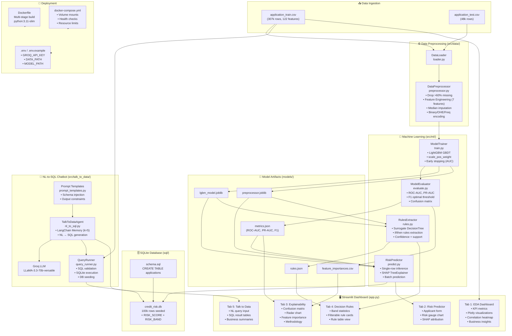

# Architecture Documentation

## System Component Diagram



---

## Module Dependency Map

```
app.py
  ├── src.utils.config          (env vars: GROQ_API_KEY, DATA_PATH, MODEL_PATH)
  ├── src.utils.logger          (structured logging)
  ├── src.data.loader           (DataLoader.load_application_train)
  ├── src.ml.predict            (RiskPredictor.predict, .get_shap_values)
  └── src.talk_to_data.nl_to_sql (TalkToDataAgent.ask, .clear_memory)

train_pipeline.py
  ├── src.data.loader           (DataLoader)
  ├── src.data.preprocessor     (DataPreprocessor)
  ├── src.ml.train              (ModelTrainer.train)
  └── src.ml.rules              (RulesExtractor.extract, .save)

src/ml/train.py
  ├── src.data.loader           (DataLoader)
  ├── src.data.preprocessor     (DataPreprocessor.fit_transform)
  └── src.ml.evaluate           (ModelEvaluator.evaluate, .get_feature_importance)

src/ml/predict.py
  └── src.utils.config          (MODEL_PATH)

src/ml/rules.py
  └── sklearn.tree              (DecisionTreeClassifier, export_text)

src/talk_to_data/nl_to_sql.py
  ├── langchain_groq            (ChatGroq)
  ├── langchain.memory          (ConversationBufferWindowMemory)
  ├── src.talk_to_data.query_runner     (QueryRunner)
  └── src.talk_to_data.prompt_templates (SYSTEM_PROMPT, templates)

src/talk_to_data/query_runner.py
  ├── src.utils.config          (DB_PATH, DATA_PATH)
  └── src.ml.predict            (RiskPredictor — for DB seeding only)
```

---

## Data Flow Description

### Training Flow
1. `train_pipeline.py` calls `ModelTrainer.train()`
2. `DataLoader.load_application_train(nrows=100000)` reads CSV into DataFrame
3. `DataPreprocessor.fit_transform(df)` → returns `(X_train, X_val, y_train, y_val)`
   - Fits imputation medians, OHE, frequency maps on X_train only
   - Applies fitted transformations to both splits
4. `LGBMClassifier.fit(X_train, y_train, eval_set=(X_val, y_val), callbacks=[early_stopping(50)])`
5. `ModelEvaluator.evaluate()` → computes ROC-AUC, PR-AUC, F1, confusion matrix
6. Artifacts saved: `lgbm_model.joblib`, `preprocessor.joblib`, `metrics.json`, `feature_importances.csv`
7. `RulesExtractor.extract(X, y_prob, y_true)` → `rules.json`

### Inference Flow (Single Applicant)
1. User fills form in Tab 2 → clicks "Assess Credit Risk"
2. `RiskPredictor.predict(input_dict)`:
   - `DataPreprocessor.transform(df_row)` → feature matrix (1 row)
   - `model.predict_proba(X_row)[0, 1]` → probability
   - Threshold comparison → risk band (Low/Medium/High)
3. `RiskPredictor.get_shap_values(input_dict)`:
   - `shap.TreeExplainer.shap_values(X_row)` → SHAP attribution per feature
   - Extract top 5 features by absolute value
4. Dashboard renders risk card, gauge chart, and SHAP bar chart

### NL-to-SQL Flow
1. User types question → `TalkToDataAgent.ask(question)`
2. Load conversation history from `ConversationBufferWindowMemory`
3. Groq LLM call with SYSTEM_PROMPT + NL_TO_SQL_TEMPLATE → SQL string
4. `QueryRunner.validate_sql(sql)` → blocks non-SELECT or forbidden keywords
5. `QueryRunner.execute(sql)` → rows, columns, row_count
6. Second Groq LLM call with ANSWER_TEMPLATE → plain English summary
7. Memory saved: (question, answer) pair added to window

---

## Security Architecture

| Concern | Mitigation |
|---------|-----------|
| SQL Injection | `validate_sql()` enforces SELECT-only + forbidden keyword blocklist |
| Secret Management | `GROQ_API_KEY` in `.env` (never committed, `.gitignore` + `.dockerignore`) |
| Container Security | Non-root `appuser` (UID 1001) runs the app |
| Read-only Data | `./data` volume mounted as `:ro` (read-only) in docker-compose |
| Rate Limiting | Groq free tier: 30 req/min; production should implement retry + exponential backoff |
