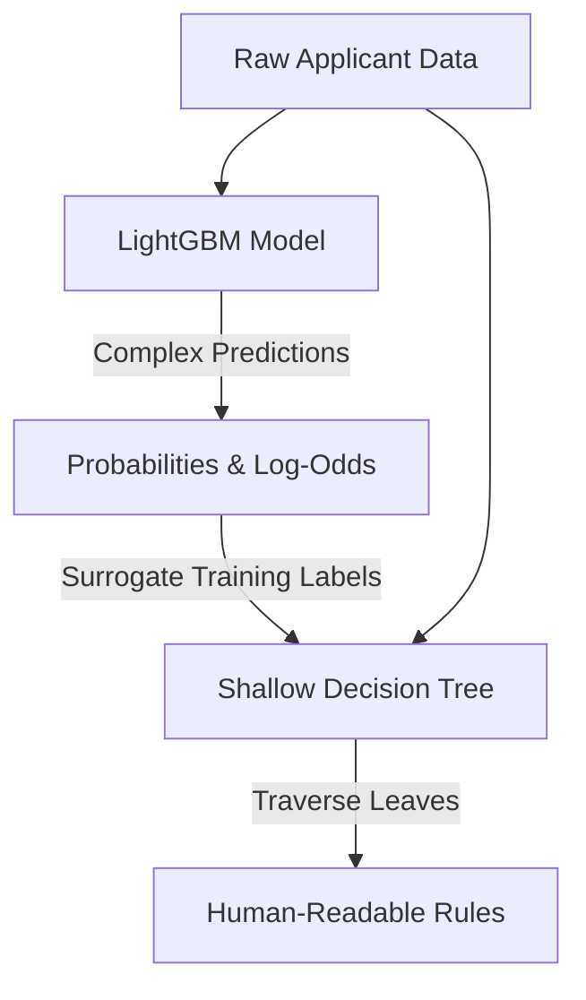

# 📋 Extracted Decision Rules — Methodology & Code Walkthrough

In high-stakes environments like credit lending, model explainability is a legal and operational requirement. While Gradient Boosted Decision Tree models (like LightGBM) offer high predictive accuracy, they function as black boxes containing hundreds of deep decision trees. 

This document explains how **RiskLens** solves this by extracting human-readable **if/then decision rules** using a **surrogate decision tree** approach.

---

## 🧠 The Concept: Global Surrogate Models

A **global surrogate model** is an interpretable model (like a shallow decision tree or linear regression) trained to approximate the predictions of a complex black-box model.



### Why we do this:
1. **Fidelity:** The surrogate model does not try to predict the true labels directly; it tries to mimic the predictions of the LightGBM model. The accuracy of this mimicry is called **fidelity**.
2. **Interpretability:** By restricting the surrogate decision tree to a maximum depth of 4 (`max_depth=4`), we can extract at most $2^4 = 16$ distinct rules.
3. **Auditability:** Financial underwriters and credit policy committees can review these rules in plain English to verify compliance with non-discrimination laws.

---

## 📁 Code Modules Overview

Decision rule extraction is driven by two main modules:

1. **[`src/ml/rules.py`](file:///d:/credit_risk_platform/src/ml/rules.py):** Contains the core logic class [`RulesExtractor`](file:///d:/credit_risk_platform/src/ml/rules.py#L22) that fits the surrogate tree, parses the conditions, humanizes labels, and generates statistics.
2. **[`extract_rules.py`](file:///d:/credit_risk_platform/extract_rules.py):** A standalone runner script that loads model artifacts, processes subset data, extracts rules, and dumps them into `models/rules.json`.

---

## 🔍 Code Walkthrough: `src/ml/rules.py`

Let's dissect the primary functions in the [`RulesExtractor`](file:///d:/credit_risk_platform/src/ml/rules.py#L22) class.

### 1. Training the Surrogate Tree (`extract`)
This method fits a scikit-learn `DecisionTreeClassifier` on the outputs of the LightGBM classifier:

```python
# Binarize probabilities using a 0.5 threshold for surrogate targets
y_surrogate = (y_pred_proba >= 0.5).astype(int)

# Fit a shallow decision tree as surrogate
self.tree = DecisionTreeClassifier(
    max_depth=self.max_depth,
    min_samples_leaf=self.min_samples_leaf,
    criterion="gini",
    random_state=42
)
self.tree.fit(X, y_surrogate)

# Compute surrogate fidelity (similarity of predictions)
surrogate_accuracy = self.tree.score(X, y_surrogate)
```
*   **Target (y_surrogate):** We convert LightGBM continuous probabilities to binary labels (`0` or `1`) at a $0.5$ cutoff. The surrogate tree learns to replicate this split.
*   **Fidelity Score:** Measured as the classification accuracy of the surrogate tree on `y_surrogate`. If the score is $85.7\%$, it means the simple decision tree agrees with the complex LightGBM model on $85.7\%$ of cases.

---

### 2. Walking the Tree (`_parse_rules_from_tree`)
Once the tree is fitted, we traverse it recursively to identify the feature splits leading to each leaf node:

```python
def recurse(node: int, conditions: List[str]) -> None:
    if tree_.feature[node] == -2:
        # We are at a Leaf Node — extract stats and build the rule
        ...
    else:
        # We are at an Internal Node — split left and right
        feat = feature_names[tree_.feature[node]]
        thresh = round(tree_.threshold[node], 4)
        
        # Humanize internal name (e.g., "EXT_SOURCE_2" -> "External Credit Score 2")
        feat_display = _humanize_feature(feat)
        
        left_cond = f"{feat_display} ≤ {thresh}"
        right_cond = f"{feat_display} > {thresh}"
        
        # Recurse children
        recurse(tree_.children_left[node], conditions + [left_cond])
        recurse(tree_.children_right[node], conditions + [right_cond])
```

#### Node Properties Evaluated at Leaves (`tree_.feature[node] == -2`):
For each leaf node, we compute important rule metrics:
*   **Support:** What percentage of total applicants fall into this leaf.
    $$\text{Support (\%)} = \frac{N_{\text{leaf}}}{N_{\text{total}}} \times 100$$
*   **Confidence:** The percentage of applicants in this leaf that share the predicted outcome.
    $$\text{Confidence (\%)} = \frac{\max(N_{\text{defaulted}}, N_{\text{repaid}})}{N_{\text{leaf}}} \times 100$$
*   **Average Default Probability:** The average prediction probability of the underlying LightGBM model for all applicants assigned to this leaf.
*   **Risk Band Assignment:**
    *   If the predicted class is `1` (Default) and average probability $\ge 50\%$, it maps to a **High** risk band.
    *   If predicted class is `1` but probability $< 50\%$, it maps to a **Medium** risk band.
    *   If predicted class is `0` (Repay), it maps to a **Low** risk band.

---

### 3. Humanizing Features & Building Descriptions
To make these rules accessible to non-technical business stakeholders, two helper functions are used:
*   **`_humanize_feature`:** Maps technical column names to business-friendly labels:
    *   `EXT_SOURCE_2` $\rightarrow$ *"External Credit Score 2"*
    *   `CREDIT_INCOME_RATIO` $\rightarrow$ *"Credit-to-Income Ratio"*
    *   `DAYS_BIRTH` $\rightarrow$ *"Age (years)"* (calculated during preprocessing)
*   **`_build_description`:** Assembles all conditions, support, confidence, and probabilities into a cohesive, grammatical statement:
    > *"Applicants where External Credit Score 2 ≤ 0.3541 and External Credit Score 3 ≤ 0.3831 present elevated default risk. This rule covers 12.4% of the portfolio with 88.5% confidence. Average default probability: 67.2%."*

---

### 4. Calibrating Portfolio Risk Bands (`_compute_band_stats`)
Independent of the surrogate tree leaves, the platform groups all applicant probabilities into global portfolio bands using calibrated percentiles:

*   **Low Risk (Bottom 40%):** Applicants below the 40th percentile of probabilities.
*   **Medium Risk (Middle 35%):** Applicants between the 40th and 75th percentiles.
*   **High Risk (Top 25%):** Applicants at or above the 75th percentile.

This ensures stable portfolio distribution constraints while monitoring actual historical default rates per band.

---

## ⚙️ Running the Rules Extraction Pipeline

You can extract the decision rules by running:

```powershell
python extract_rules.py
```

### Pipeline Steps:
1. Loads the LightGBM classifier from `models/lgbm_model.pkl`.
2. Loads the fitted pipeline preprocessor from `models/preprocessor.joblib`.
3. Loads a sample data segment ($30,000$ rows) and transforms features.
4. Generates predictions from LightGBM.
5. Invokes [`RulesExtractor`](file:///d:/credit_risk_platform/src/ml/rules.py#L22) to fit a Decision Tree (using `max_depth=4` and a minimum leaf constraint of $200$ rows to avoid overfitting).
6. Outputs the structured rule logs to the console and dumps the final dictionary (rules + statistics) to `models/rules.json`.

---

## 🖥️ UI Integration in Streamlit (`app.py`)

In the Streamlit app ([app.py](file:///d:/credit_risk_platform/app.py)), the decision rules are loaded and rendered dynamically:

*   **HTML Rule Cards:** Custom styling renders rule cards with left-border color accents (Green for Low Risk, Orange for Medium Risk, Red for High Risk) matching scikit-learn metrics.
*   **Interactive Filters:**
    *   *Selectbox Filter:* Displays only rules of a specific risk band.
    *   *Slider Filter:* Dynamically hides rules with low support (frequency).
    *   *Sorting Selector:* Re-orders rules based on Support (coverage), Confidence (precision), or Average Default Probability.
*   **Tabular View:** Uses `extractor.get_rule_table()` to render a clean tabular report of all rules, making it easy to download or export.
